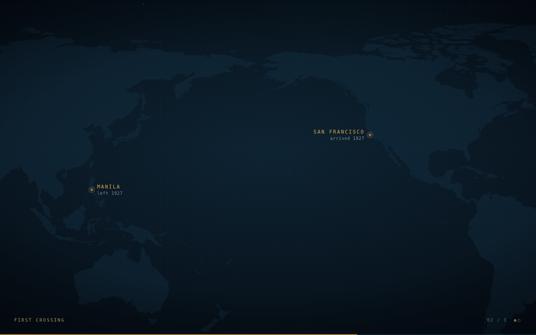
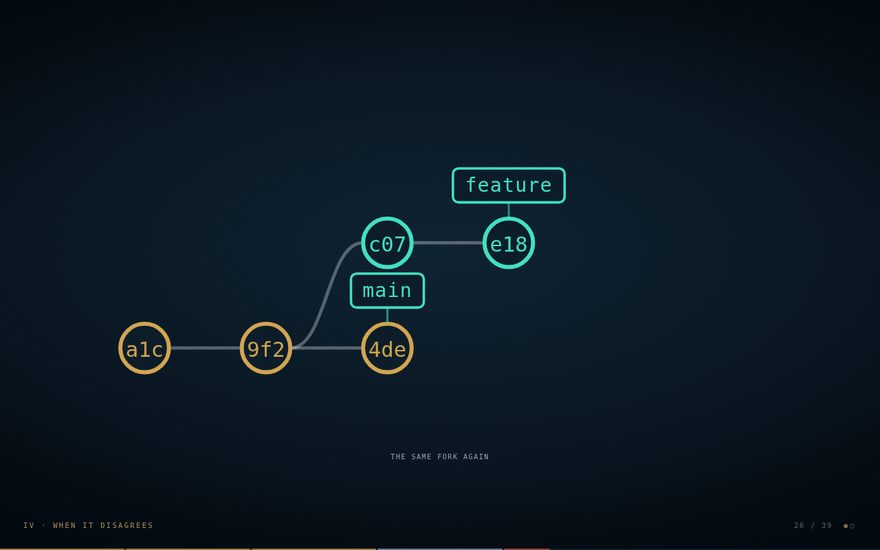

# Great Circle

**Presentations that map the journey.**

A camera-driven canvas presentation engine. You write one file. You get one
portable HTML file.



```bash
git clone https://github.com/karlok/greatcircle
cd greatcircle && npm install
npm run crossing     # the deck in the GIF above
```

Once the packages are on npm that becomes `npm create greatcircle@latest my-talk`.
Node 18+. Bun works too if you prefer it, Playwright included, and produces a
byte-identical build.

---

## It's a loop!

There is no GUI, no chat box, no API key and no auth surface anywhere in this
project. The authoring interface is a small legible data file, and coding agents 
are extremely good at editing small legible data files.

So the intended usage is: **point an agent at your deck folder and tell
it what you want in your talk.** `AGENTS.md` is scaffolded next to your `scene.js` 
and teaches it the schema, the coordinate system, the camera language and the house 
rules.

Then the loop:

```
1. the agent edits scene.js
2. npm run sheet      -> EDIT-SHEET.md, regenerated FROM SOURCE every time
3. a human reads the markdown by beat number and marks it up with >> notes
4. npm run verify -- --shots   walks every beat and screenshots each one,
                               so the agent can look at what it built
5. npm run build      -> one portable HTML file, which is what you present
```

Step 2's emphasis is critical (and the DX to be improved). Generating the sheet 
once and hand-patching it afterwards caused a real incident: the reviewer approved
content that had already been cut. CI regenerates every sheet on push and fails
if the committed one is stale. So you can't forget.

Step 4 is also important. An agent that can verify its own output is worth more 
than one with a nicer chat interface.

---

## The format

Two lists. Here is the whole deck from the GIF at the top of this page:

```js
const SUBSTRATE = 'world-map';
const SEAM = 60;                                 // where the projection is cut
const P = { manila: LL(121.00, 14.60), sf: LL(-122.20, 37.60) };

const NODES = [                                  // WHAT EXISTS
  pin('p.manila', P.manila, 'Manila',        'left 1927',     190),
  pin('p.sf',     P.sf,     'San Francisco', 'arrived 1927',  190, 'l'),
  arc('a.cross',  P.manila, P.sf, .20),
];

const BEATS = [                                  // WHAT HAPPENS
  { act: 0, cam: cam(9000, 4500, 15000),
    show:   ['p.manila', 'p.sf'],
    steps:  [[], ['a.cross']],                   // one key press each
    stepVo: [`Two ports.`, `And the crossing between them.`] },
];
```

That is [`examples/first-crossing`](examples/first-crossing/scene.js), minus a
title beat and the pull-back at the end.

`cam(x, y, w)`: `w` is how much of the world fits across the screen. Smaller
is more zoomed in. That one number is the entire camera language.

`steps` lets one beat hold several key presses without changing the beat
count, so beat 12 is still beat 12 after it grows a fourth reveal. That is
what makes review-by-beat-number survive a restructure.

Full reference in [AGENTS.md](AGENTS.md).

---

## Animated diagrams



`graph()` takes a second state and morphs between them on one key press: refs
slide to their new commits, new commits fade in, abandoned ones fade back.

```js
graph('g.rebase', x, y, w, BEFORE, { to: AFTER, capTo: 'replayed as new commits' })
```

This works because in git a commit never moves. Only the pointers do. Fixing
every commit's position across both states means no path interpolation is
needed, and what you see animate is exactly what git actually does.

That example is [`examples/git-territories`](examples/git-territories/scene.js),
a talk about git. The engine has no idea what git is: it moves a camera and
reveals nodes, and the meaning is entirely yours.

---

## Motion

The camera path is van Wijk and Nuij's optimal zoom-and-pan (1996), which
models `(x, y, zoom)` as a point in hyperbolic space and solves for the
geodesic between two camera positions. A great circle is the geodesic on a
sphere, so that's why the name: the engine computes great circles in camera 
space.

In practice it means the camera pulls back and dives in on its own when the
distance warrants it, instead of lerping. That is the coolness this tool offers.

---

## Commands

Every command takes a deck folder, defaulting to the current directory.

| | |
|---|---|
| `greatcircle new <dir>` | scaffold a deck folder |
| `greatcircle dev` | serve it. Edit `scene.js` and refresh |
| `greatcircle sheet` | write `EDIT-SHEET.md` from source |
| `greatcircle verify` | headless walk of every beat. `--shots` writes PNGs |
| `greatcircle build` | one portable HTML file. `-o` to name it |

`verify` starts its own server, so there is nothing to run first. It needs
Playwright; nothing else does. Authoring needs a text editor.

---

## What is what

Your deck folder holds your content and nothing else:

```
my-talk/
  scene.js        your deck. The source of truth
  EDIT-SHEET.md   generated from scene.js. What a human reviews
  AGENTS.md       the briefing for a coding agent
  theme.css       optional. Override any colour or face
  substrate.js    optional. Bring your own background
  img/            photos, referenced by basename
```

The engine lives in `node_modules/@greatcircle/core`, so an engine fix
reaches you with `npm update` rather than a merge.

---

## Reviewing

`EDIT-SHEET.md` is how someone reviews a talk without reading any code. It is
every beat in order, by number, with the voice-over and what appears on screen:

```
## 06 / 39  ·  II · Four territories

THIS BEAT IS 3 PRESSES. Each one is a separate → on the night.

  ── press 2 of 3 ──

  VOICE OVER:
    It is one binary file, .git/index, and it holds a complete proposed
    snapshot of your next commit. Not a to-do list of files you flagged.

  APPEARS NOW:
    [n.ix]
```

Edit the prose in place. Leave the `[id]` markers alone. Drop a line starting
with `>>` anywhere for a note back to whoever is editing the deck:

```
>> this beat drags, cut it
>> swap this photo for the one in extras
>> hold longer here
```

Then hand it to the agent. It reconciles your notes into `scene.js` by node id
and regenerates the sheet.

**The sheet is generated, so your notes are temporary by design.** The next
`greatcircle sheet` overwrites the file. That is the point: a sheet that could
drift from the deck is how a reviewer ends up approving content that was cut
last week. Notes live in your working copy for as long as it takes to apply
them, and the committed sheet is always clean.

So if CI tells you a sheet does not match, it means one of two things: the deck
moved and nobody regenerated, or there are `>>` notes nobody applied.

---

## Examples

```bash
npm run territories   # "Git, as a place" — 39 beats, five animated diagrams
npm run crossing      # three beats: a line drawing itself across a chart
npm run plates        # six photographs, and a compositor bug
```

| | |
|---|---|
| [`git-territories`](examples/git-territories/scene.js) | A fully worked 39-beat talk |
| [`first-crossing`](examples/first-crossing/scene.js) | The visual identity in one screen |
| [`plates`](examples/plates/scene.js) | `plate()` worked, and the regression case for the repaint stall |

Each has an `EDIT-SHEET.md` next to it, which is what a human reviews.

---

## Substrates

The background is a plugin. It is empty by default.

- `grid` — a near-invisible rule grid. The default
- `blueprint` — engineering-drawing paper, border and registration marks
- `world-map` — real coastlines, graticule, rhumb web, compass rose, starfield

A `substrate.js` next to your `scene.js` is picked up automatically. The
substrate is your cool background scenery, so thematically important.

---

## Presenting

`P` opens a separate presenter window with your voice-over, a timer and the
next line. Chrome's tab capture is compositor-level, so share the deck **tab**
in Meet, never the screen, and the presenter window stays private.

`?` for the rest of the keys.

---

## Status

v0.1. The engine, the schema, the loop and three worked examples. It has
carried one real 47-beat talk, live, served as a single static file.

Known open issue: an intermittent repaint stall on large rasters, which never
reproduces headless. `examples/plates` exists to exercise it and documents how
to test by hand.

---

## Not on the roadmap

A GUI. Hosting. Accounts. An API-key overlay. A chat window. If any of those
ever ship, the project has lost the plot.

Next up will be the video renderer. Because the camera is a pure function of time, 
the same file that drives a live talk renders offline to a video file at any
resolution, with no screen recording and no dropped frames.

---

MIT.
